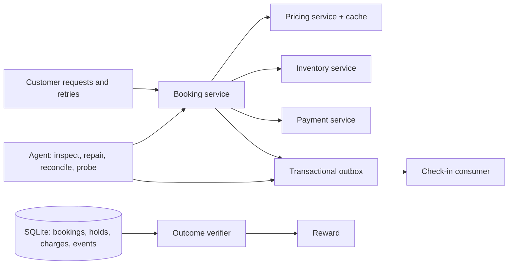

# Airline Recovery Env

**An OpenEnv and Harbor environment where an agent repairs broken transactions in running services, and is graded on what actually happened to the customers.**

A payment commits, then its acknowledgement times out. The booking is stuck
pending, the customer retries, and check-in never hears about it. The agent has
to find out what happened, fix the dependency, complete the accepted bookings and
prove each customer was charged exactly once. Restarting things and retrying
everything can make the dashboard green while a customer pays twice:

```text
$ python -m airline_recovery showcase --seed 42
strategy         outcome     reward  steps  duplicate-charged bookings  excess capture (synthetic $)
---------------  ----------  ------  -----  --------------------------  ----------------------------
blanket          NOT SOLVED     0.0     13                           2                       $400.00
reference        SOLVED         1.0     13                           0                         $0.00
reference-adopt  SOLVED         1.0     13                           0                         $0.00
source-aware     SOLVED         1.0     17                           0                         $0.00
```

Each episode runs **five real HTTP service processes** (pricing, inventory,
payment, booking, check-in) over a SQLite database. Rewards come from executed
customer requests and the resulting transaction records, never from comparing
settings against a hidden correct configuration. Everything is synthetic.

**Status: research preview (0.5.0).** The environment, grader and scripted
baselines are tested, and three coding-agent CLIs have been measured on both
tiers. No model has been trained here, and a careful hand-written procedure
(`reference` on the easy tier, `oracle` on the hard tier) still solves every case. Read
[what scores do and do not mean](docs/LIMITATIONS.md) before quoting a number.

## Try it in one minute

Python 3.11+. No model, GPU, API key, database server or Docker needed.

```bash
git clone https://github.com/Devesh-Maheshwari/airline-recovery-env.git && cd airline-recovery-env
python -m venv .venv && source .venv/bin/activate
pip install -e .
python -m airline_recovery demo          # watch a scripted recovery, step by step
python -m airline_recovery showcase --overwrite   # the four-strategy comparison above
```

`airline-recovery demo` prints one line per action with the number of stuck bookings,
undelivered events and verification windows, and ends with the outcome. It runs a
hand-written reference policy, not a trained model.

## What the agent does



The agent gets alerts and twelve tools: read metrics, request logs and settings;
run bounded read-only SQL; restart a worker; patch settings; invalidate the fare
cache; reconcile a pending booking (by retrying a specific payment key or
adopting an existing charge); replay or quarantine queue events; probe; finish.
Customer traffic advances after every action, and some tasks inject a second
fault while the agent is working. The budget is 48 actions.

An episode is solved only if every accepted booking reaches check-in, fresh
customer requests succeed, two verification probes pass after the last change,
and **no integrity violation occurred at any point**: one charge per booking for
the accepted amount, no oversold flight, accepted fares preserved, no valid event
discarded. A violation sets the reward to zero for the rest of the episode. After
`finish`, a declared safety check retries a lost-acknowledgement booking and
books across a fare change against the settings the agent left behind, so turning
the guards off after recovering does not pass.

Full reference: [tools, observations, reward formula, violation codes and the case table](docs/ENVIRONMENT.md).

## Tasks

| Split | Cases | What goes wrong |
|---|---:|---|
| Train | 5 | Lost payment acknowledgement; paused check-in consumer; stale fare cache; crashed pricing worker; payment-key migration |
| Eval | 3 | Malformed queue event; new event schema; payment-key migration followed by a fare change |
| Test | 3 | Compound, with the second fault arriving mid-recovery: timeout then malformed event; payment outage then fare change; payment-key migration then schema change |

Task IDs and observations do not name the fault. The seed sets the incident's
shape: fault parameters, how many bookings a migration interrupts, which of three
malformed-event shapes appears, and when the delayed fault lands. Booking, charge
and event IDs are freshly salted every episode and must be read from the system.

## Difficulty tiers

The eleven tasks above are the **easy tier**: tool descriptions explain each
fault and its fix, every fix is safe everywhere, the ledger is complete, and
nothing degrades while you look. Frontier coding agents solve it. The **hard
tier** removes those properties and generates its cases:

| | Easy | Hard |
|---|---|---|
| Cases | 11 hand-written | Generated from fault pools; 12 task slots at three levels; 17 case structures at level 1, 600 at level 2, about 6,000 at level 3 |
| Tool text | Explains what to look for and how to fix it | States what each call does to which rows |
| Payment truth | Every charge is in the local ledger | A capture can be captured, declined or pending at a private provider; two to four rationed lookups (shown as `provider_lookups_remaining`), or wait for settlement |
| Retries | Idempotent | Keys expire; a cancelled request must be voided, a duplicate request must not become two sales |
| Telemetry | Reliable | Alerts can mislead, a log line can lie, a worker can look unhealthy while holding in-flight captures |
| Budget and reward | 48 actions, no cost term | 32–36 actions, a cost term, abandoning customers, and a settlement horizon so finishing early fails |

Select it with `--tier hard` on `list`, `demo`, `build-harbor`, the evaluator
and the external runner, or `tier="hard"` on reset. A bundled `oracle` solves
every generated case from public evidence; `blanket-hard` and two one-branch
controls show the symptom-only runbooks failing. Details:
[hard tier reference](docs/ENVIRONMENT.md#hard-tier).

## Baselines

Scripted policies on all 11 easy tasks × seeds 1–5 (55 episodes each), version 0.4.0:

| Policy | Episodes solved | Tasks solved on every seed | Episodes with an integrity violation | Mean reward | What it is |
|---|---:|---:|---:|---:|---|
| `reference` | 55 / 55 | 11 / 11 | 0 | 1.00 | Hand-written diagnostic workflow: reads metrics, logs, settings and the ledger, then repairs |
| `reference-adopt` | 55 / 55 | 11 / 11 | 0 | 1.00 | Same, but adopts existing charges instead of retrying their keys |
| `source-aware` | 45 / 55 | 7 / 11 | 0 | 0.85 | Fixed repair prefix plus charge IDs inferred from the public source; never reads the ledger |
| `blanket` | 31 / 55 | 5 / 11 | 15 | 0.60 | Restart, raise timeouts, retry everything pending; double-charged customers in 15 episodes |
| `nop` | 0 / 55 | 0 / 11 | 0 | 0.11 | Probes and finishes without repairing anything |

The gap between `reference` and the two shortcut scripts is the point of the
environment: acting without reading the evidence is unsafe on some seeds of six
tasks. These are **scripted baselines, not model results**, and `reference`
shows that a careful hand-written rule solves every case. Per-task results and
provenance are in [`evidence/v0.4.0/`](evidence/); reproduce any row with
`python -m airline_recovery.live.evaluate --policy <name> --split all --seeds 1,2,3,4,5 --output runs/<name>`.

### Coding agents on the easy tier

Claude Code and Codex, each given only the Harbor control script and graded by
the sidecar's signed receipt (`python -m airline_recovery.live.external`), on
all 11 easy tasks × seeds 1–3:

| Agent | Episodes solved | Tasks solved on every seed | Episodes with an integrity violation | Mean steps | API cost |
|---|---:|---:|---:|---:|---:|
| Codex, gpt-6-astra | 33 / 33 | 11 / 11 | 0 | 11.9 | subscription |
| Claude Code, Sonnet 5.5 | 32 / 33 | 10 / 11 | 0 | 12.4 | $4.21 |
| Claude Code, Haiku 4.5 | 30 / 33 | 8 / 11 | 0 | 18.1 | $4.81 |

No agent ever double-charged a customer; every failure was a skipped
verification step or an episode ended without `finish`. The easy tier is
saturated for frontier agents, which is why the hard tier exists. Records:
[`evidence/v0.4.0/agents/`](evidence/v0.4.0/agents/).

### Hard tier

Scripted policies on all 12 hard task slots, version 0.5.0 (`oracle`: seeds 1–6,
72 episodes; controls: seeds 1–3, 36 episodes):

| Policy | Episodes solved | Tasks solved on every seed | Solved by level 1 / 2 / 3 | Episodes with an integrity violation | Mean steps | What it is |
|---|---:|---:|---|---:|---:|---|
| `oracle` | 72 / 72 | 12 / 12 | 24/24 · 24/24 · 24/24 | 0 | 19.4 | Observation-only procedure: reads the ledger, resolves unknown payments by lookup or settlement, voids cancelled and duplicate requests, repairs settings in scope |
| `reference` (easy-tier policy) | 6 / 36 | 1 / 12 | 6/12 · 0/12 · 0/12 | 30 | 28.4 | The runbook that solved the easy tier; here it double-charges or completes cancelled bookings |
| `adopt-else-reconcile` | 6 / 36 | 1 / 12 | 6/12 · 0/12 · 0/12 | 30 | 23.7 | One-branch rule: adopt a charge if one exists, otherwise retry |
| `wait-then-reconcile` | 6 / 36 | 1 / 12 | 6/12 · 0/12 · 0/12 | 30 | 28.1 | One-branch rule: wait half the budget, then retry everything pending |
| `source-aware` | 3 / 36 | 0 / 12 | 3/12 · 0/12 · 0/12 | 30 | 19.9 | Easy-tier shortcut that inferred charge IDs from the source |
| `blanket-hard` | 3 / 36 | 0 / 12 | 3/12 · 0/12 · 0/12 | 30 | 17.7 | Restart everything, raise timeouts, evict every cache, retry every pending booking |
| `blanket` | 3 / 36 | 0 / 12 | 3/12 · 0/12 · 0/12 | 30 | 14.7 | The easy-tier blanket runbook |
| `nop` | 3 / 36 | 0 / 12 | 3/12 · 0/12 · 0/12 | 0 | 9.0 | Probes and finishes; correct only on the alert-only instances |

The three level-1 solves shared by every control are the deliberate alert-only
instances where nothing is broken and doing nothing is right. Every other
shortcut fails for the designed reason: cancelled bookings completed, one
customer sold two seats, or a provider-captured payment charged again. The
oracle's mean terminal reward at success is about 0.8 because the hard reward
charges for every read, mutation and lookup; compare runs on `success` and
`tasks_solved_on_every_seed`, not on reward. Records:
[`evidence/v0.5.0/hard/`](evidence/v0.5.0/hard/).

**Coding agents on the hard tier.** All 12 slots × seeds 1–5 (60 episodes per
agent), each agent given only the Harbor control script and graded by the
sidecar's signed receipt:

| Agent | Episodes solved | Tasks solved on every seed | Solved by level 1 / 2 / 3 | Failures with an integrity violation | Mean steps | API cost |
|---|---:|---:|---|---:|---:|---:|
| Codex, gpt-6-astra | 46 / 60 | 4 / 12 | 20/20 · 14/20 · 12/20 | 13 of 14 | 21.2 | subscription |
| Claude Code, Sonnet 5.5 | 14 / 60 | 1 / 12 | 13/20 · 0/20 · 1/20 | 41 of 46 | 28.0 | $15.11 |
| Claude Code, Haiku 4.5 | 10 / 60 | 0 / 12 | 10/20 · 0/20 · 0/20 | 42 of 50 | 29.2 | $15.11 |

The same agents scored 30–33 out of 33 on the easy tier. The hard-tier failures
are the designed ones:

- **Codex** solved every level-1 instance. All 13 of its integrity failures were
  bookings accepted at a fare other than the one promised: it turned the fare
  cache off early (or later evicted the held flight's quote), so a fare hold that
  arrived mid-episode was never honoured. The environment honours a fare hold
  only through its cached quote; an agent can infer this from the `cache` and
  `fare_holds` tables, but no tool or setting description states it. Treat these
  13 as an open validity question ([scenarios](docs/SCENARIOS.md)).
- **Claude Code** completed bookings the customer had cancelled (Sonnet in 35
  episodes, Haiku in 27), sold one customer two seats (10 and 27), and charged
  provider-captured payments again (6 and 9; $1,500 and $2,850 of synthetic
  excess capture). Sonnet ran out of budget in 16 episodes and Haiku in 3, almost
  always already carrying a violation.
- The few failures without a violation finished before verifying, or (Haiku,
  twice) never finished.

Five seeds per slot is still a small sample; read this as a first calibration,
not a leaderboard. Reproduce with
`python -m airline_recovery.live.external --agent <claude-code|codex> --model <model> --tier hard --split all --seeds 1,2,3,4,5 --output runs/<name>`.
Per-episode records, token usage and every episode's action log:
[`evidence/v0.5.0/hard/agents/`](evidence/v0.5.0/hard/agents/).

**Do the failures come from the task or from the environment's limits?**
- [Failure analysis](evidence/v0.5.0/hard/failure-analysis/README.md): 96 of the
  110 failed episodes above are integrity harm caused by the agent's own action,
  first harm at a median of 36% of the budget; 10 could plausibly be blamed on the
  budget or the interface.
- [Ablations](evidence/v0.5.0/hard/ablations/README.md): rerunning Sonnet and
  Haiku on 24 instances with the integrity rules spelled out, or with twice the
  action budget, changes each score by at most two episodes, and level 2 stays
  unsolved. These runs keep full traces (every observation the agent saw).
- [Scenarios](docs/SCENARIOS.md): which real-world failure each mechanism stands
  for, what is simplified, and how many distinct case structures exist (17, 600
  and about 6,000 at levels 1–3).
- [Throughput](evidence/v0.5.0/throughput/README.md): about 1,000 oracle episodes
  per hour per episode slot, 4,100 per hour with eight in flight on one laptop.

Not yet done: independent expert review of the payment and refund rules, a human
check of the grader's verdicts, a solver who did not build the environment, and
any training run.

**Open models (partial).** Four open models were run through Together AI with
`examples/openai_compatible_agent.py` before the account hit its credit limit, so
only the episodes below ran to completion, almost all on the first train tasks.
They are not a balanced sample:

| Model | Easy: solved / finished | Hard: solved / finished | Hard episodes with an integrity violation |
|---|---:|---:|---:|
| Kimi K3 | 3 / 6 | 2 / 6 | 2 |
| gpt-oss-120b | 1 / 13 | 1 / 11 | 0 |
| Llama 3.3 70B | 0 / 6 | 2 / 7 | 0 |
| GLM 5.3 | 0 / 13 | 0 / 12 | 0 |

Every open-model hard solve was on the same level-1 slot (`hard-train-001`).
Unlike the frontier agents, the open models mostly failed without harming
anyone: they stopped before the recovery was complete or verified. Records:
[`evidence/v0.5.0/open-models-partial/`](evidence/v0.5.0/open-models-partial/).

## Bring your agent

Any Python callable from observation to action works:

```python
# my_agent.py
def choose_action(observation):
    # The first observation carries the tool schemas and the episode rules.
    return {"tool": "get_logs", "arguments": {"service": "booking"}}
```

```bash
python -m airline_recovery.live.evaluate --policy my_agent:choose_action \
  --split train --index 0 --seeds 1 --output runs/my-agent
```

That example only reads logs, so it runs out of budget and scores low; it shows
the contract. Working starting points:

- [`examples/llm_agent.py`](examples/llm_agent.py): a Claude model driving the tools through native tool calling (needs `pip install anthropic` and an API key; spends credits).
- [`examples/custom_agent.py`](examples/custom_agent.py): the minimal adapter around a scripted policy.

Results land in the output directory as `summary.json`, `episodes.jsonl` and full
`trajectories.jsonl`. Add `--export-sft train.jsonl` to export successful train
episodes as chat or tool-calling conversations. A local Python policy shares a
process with the grader, so local scores are self-reported; use OpenEnv or Harbor
below when that matters. [Agent guide](docs/AGENTS.md).

### Live demo

The [Hugging Face Space](https://huggingface.co/spaces/dmaheshwar22/airline-recovery-env)
shows step-by-step replays of every recorded hard-tier episode in the browser.
To repair an incident yourself, run the OpenEnv server below and open its
playground at `/web/`; the same replay page is served at `/replays`. Rebuild the
replay data after new runs with `python scripts/build_replays.py`, and the static
Space with `python scripts/build_static_space.py <dir>`.

### OpenEnv

```bash
pip install -e '.[openenv]'
python -m airline_recovery.openenv_adapter.server        # playground at http://127.0.0.1:8000/web/
```

```python
from airline_recovery.openenv_adapter import AirlineEnv, AirlineAction

with AirlineEnv(base_url="http://127.0.0.1:8000").sync() as env:
    result = env.reset(seed=42, split="train", index=0)
    result = env.step(AirlineAction(tool="get_metrics", arguments={}))
```

Each WebSocket session gets its own five workers and database. The root
`Dockerfile` builds the same server for a Hugging Face Docker Space:
`docker build -t airline-recovery-env . && docker run --rm -p 8000:8000 airline-recovery-env`.
[OpenEnv guide](docs/OPENENV.md).

### Harbor

```bash
harbor run -p live-tasks/train -a oracle -n 2
```

Each task runs the world in a sidecar container the agent cannot read. There is
one episode with a fresh seed, its actions cannot be undone, and the verifier
accepts only the sidecar's signed receipt of the outcome. `python -m airline_recovery
build-harbor --tier all` regenerates both tiers with fresh signing keys; the keys committed
in `live-tasks/` are public, so regenerate them for anything you score privately.
Without `--tier all` only the easy tasks are rewritten and the hard tasks keep their public keys.

## Scope and related work

Airline Recovery Env runs real processes and real database transactions at laptop scale. It does
not run PostgreSQL, Kafka or Kubernetes, the payment service is a local ledger,
and the airline is invented; it is not affiliated with any carrier.

- [τ-bench](https://arxiv.org/abs/2406.12045) and [τ²-bench](https://arxiv.org/abs/2506.07982) grade database end state in an airline domain, but for customer-service conversations on a healthy system. Airline Recovery Env is the operator side: repairing a faulted system.
- [SREGym](https://arxiv.org/abs/2605.07161), [ITBench](https://arxiv.org/abs/2502.05352) and [AIOpsLab](https://arxiv.org/abs/2501.06706) inject infrastructure faults into live Kubernetes stacks. Airline Recovery Env is application-level, needs no cluster, and grades business records rather than service health.
- [FinalityBench](https://arxiv.org/abs/2609.04706) is the nearest neighbour: simulated decisions under uncertain payment finality, graded on monetary effects. Airline Recovery Env executes the services and requires the repair.
- [DBA-Bench](https://arxiv.org/abs/2607.22165) grades safe outcomes in live PostgreSQL operations.

Airline Recovery Env is far smaller than all of these (eleven hand-written cases
plus a generated hard tier of twelve slots). Its contribution is a
low-dependency environment where an unsafe fix has a measurable business
consequence.

## Develop

```bash
python -m unittest discover -s tests -v     # OpenEnv tests skip unless the extra is installed
```

The full suite takes roughly 10 to 20 minutes; `test_hard_controls` and
`test_hard_oracle` take most of it (`AIRLINE_HARD_SEEDS=1` shortens the oracle test).

The core has no third-party runtime dependency. New incidents should come with a
reproduced failure, an unsafe shortcut that the verifier catches, and a safe
recovery: see [CONTRIBUTING.md](CONTRIBUTING.md). Also: [changelog](CHANGELOG.md),
[trust boundary](SECURITY.md), [showcase walkthrough](docs/SHOWCASE.md). MIT licensed.
